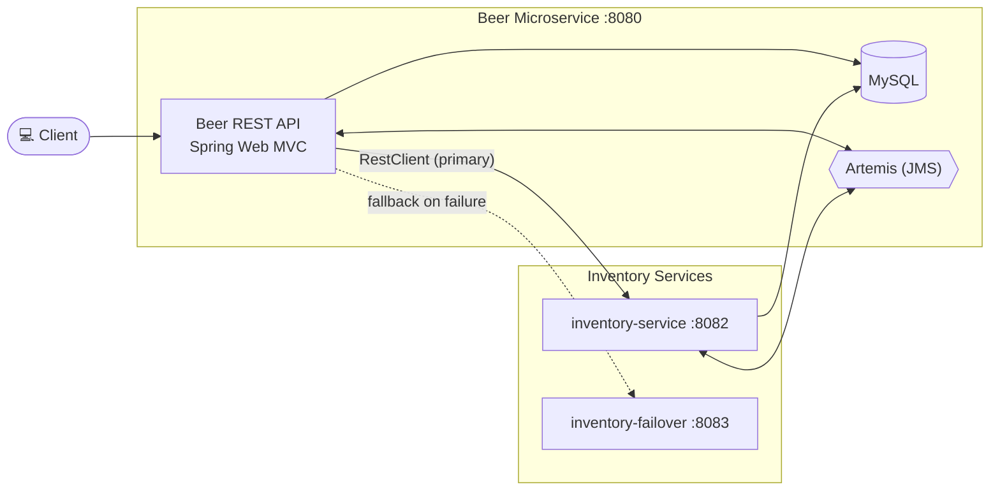

# KBE Brewery — Beer Microservice

Spring Boot 4 / Spring Framework 6 beer microservice (Java 25). Exposes a Beer REST API, backed by
MySQL (JPA) and Artemis (JMS), with a gateway-style inventory integration against
`kbe-brewery-inventory-micro-service` and `kbe-brewery-inventory-failover`.

This project is one element of the KBE. See the Gateway Project for a detailed description:
https://github.com/dboeckli/kbe-brewery-gateway/blob/master/README.md

Original git repository: https://github.com/springframeworkguru/kbe-sb-microservices.git

## Architecture Overview



### Role of the services

**kbe-brewery-beer-micro-service** (:8080) — the main application. It exposes the Beer REST API
(Spring Web MVC) for beers, backed by MySQL (JPA) for persistence and Artemis (JMS) for asynchronous
brewing/order events. On each beer lookup it asks the inventory-service for the current
`quantityOnHand` (see `BeerInventoryServiceImpl`) and falls back to the failover service if that
call fails.

**inventory-service** (`kbe-brewery-inventory-micro-service`, :8082) — the primary inventory source.
It reads beer inventory from MySQL (JPA) and listens on Artemis queues (`new-inventory`,
`allocate-order`, `allocate-order-result`) via `@JmsListener`. The beer microservice calls it with
RestClient (`BeerInventoryServiceImpl.getOnhandInventory`) at `/api/v1/beer/{beerId}/inventory`.

**inventory-failover** (`kbe-brewery-inventory-failover`, :8083) — a stateless dummy fallback.
It exposes a single WebFlux endpoint `GET /inventory-failover` that always returns a hardcoded
inventory with `quantityOnHand: 999`; it uses neither a database nor queues. The beer microservice
only calls it when the primary inventory call fails (`BeerInventoryServiceImpl` catch block), so the
order process stays functional even when the real inventory is unreachable.

## Prerequisites

|   Requirement   | Version  |
|-----------------|----------|
| Java            | 25       |
| Maven Wrapper   | included |
| Docker          | any      |
| Kubernetes/Helm | optional |

## Build & Test

```bash
./mvnw clean verify          # full build: format check, unit + IT tests, Helm lint/template
./mvnw clean install         # verify + build local Docker image + Helm package (target/helm/repo)
./mvnw test                  # unit tests only (surefire, *Test)
./mvnw verify                # integration tests only (failsafe, *IT)
./mvnw test -Dtest=BeerControllerTest              # single test class
./mvnw test -Dtest=BeerControllerTest#methodName   # single test method
./mvnw spotless:apply        # auto-fix pom/markdown/json/yaml/shell formatting
./mvnw spring-javaformat:apply                     # auto-fix Java code style
```

> Formatting is enforced at build time (fails the `validate` phase). Run both `spotless:apply` and
> `spring-javaformat:apply` before committing if the build fails.

## Sandbox (local dev environment)

The sandbox consists of the app (Spring Boot, port 8080) plus MySQL, Artemis (JMS) and the
inventory apps, provided by `compose.yaml`. The services start automatically via
`spring.docker.compose.enabled=true` when the app boots, so usually one step is enough.

### Start the sandbox (opencode-sandbox-kit)

The sandbox is provisioned by the opencode-sandbox-kit and runs as a Docker container. It mounts this
repo, starts opencode, and connects the IntelliJ MCP server.

Allow the kit source (GitHub without cloning):

```powershell
sbx settings set kit.allowedSources --% "[\"docker.io/\",\"github.com/dboeckli/\"]"
```

Start a new sandbox:

```powershell
sbx run opencode --name kbe-brewery-beer-micro-service --kit "git+https://github.com/dboeckli/opencode-sandbox-kit.git#dir=opencode-agent" "C:\development\projects\kbe-brewery-beer-micro-service"
```

Start the sandbox with Kubernetes support:

```powershell
sbx run opencode --name kbe-brewery-beer-micro-service --kit "git+https://github.com/dboeckli/opencode-sandbox-kit.git#dir=opencode-agent" "C:\development\projects\kbe-brewery-beer-micro-service" "$env:USERPROFILE\.kube:ro"
```

Apply the kit to an existing sandbox (restarts the sandbox, VM state is kept):

```powershell
sbx kit add kbe-brewery-beer-micro-service "git+https://github.com/dboeckli/opencode-sandbox-kit.git#dir=opencode-agent"
```

### Start the app

Run the `BeerServiceApplication` run configuration in IntelliJ
(`.run/BeerServiceApplication.run.xml`, main class
`ch.dboeckli.springframeworkguru.kbe.beer.services.BeerServiceApplication`). Alternatively start via
`./mvnw spring-boot:run`.

The compose file brings up:

- `mysql` (port 3306) — database `beerservice`
- `jms` (ports 61616/8161) — Artemis broker + console
- `inventory-service` (port 8082) and `inventory-failover` (port 8083) — inventory apps
- `busybox` — logs readiness of the inventory apps

### Verify

- Actuator health: http://localhost:8080/actuator/health
- Artemis console: http://localhost:8161/console

## Running Locally

Start the application with `./mvnw spring-boot:run`. Spring Boot Docker Compose auto-starts
`compose.yaml` (MySQL, Artemis, inventory apps) on startup.

### Endpoints

|  Resource   |                 Local                 |          Kubernetes (NodePort)           |
|-------------|---------------------------------------|------------------------------------------|
| Application | http://localhost:8080                 | http://\<node-ip\>:30080                 |
| Beer API    | http://localhost:8080/api/v1/beer     | http://\<node-ip\>:30080/api/v1/beer     |
| Actuator    | http://localhost:8080/actuator/health | http://\<node-ip\>:30080/actuator/health |
| Artemis     | http://localhost:8161/console         | http://\<node-ip\>:30161                 |

Beer API endpoints (see `BeerController`):

| Method |          Path           |    Description     |
|--------|-------------------------|--------------------|
| GET    | `/api/v1/beer`          | List beers (paged) |
| GET    | `/api/v1/beer/{beerId}` | Get a beer by id   |
| GET    | `/api/v1/beerUpc/{upc}` | Get a beer by UPC  |
| POST   | `/api/v1/beer`          | Create a beer      |
| PUT    | `/api/v1/beer/{beerId}` | Update a beer      |
| DELETE | `/api/v1/beer/{beerId}` | Delete a beer      |

### IntelliJ HTTP Client

The `restRequest/` folder contains IntelliJ HTTP request files for manual API testing:

|              File              |                Coverage                 |
|--------------------------------|-----------------------------------------|
| `beerController.http`          | Beer CRUD endpoints                     |
| `beerInventoryController.http` | Inventory endpoints (inventory-service) |
| `failover-service.http`        | Inventory failover endpoints            |
| `actuator.http`                | Actuator/health endpoints               |

Environments are configured in `restRequest/http-client.env.json`:

| Environment | App port | Inventory-Service port | Failover port |              Use for              |
|-------------|----------|------------------------|---------------|-----------------------------------|
| `local`     | 8080     | 8082                   | 8083          | Local run via IntelliJ run config |
| `k8s`       | 30080    | 30082                  | 30083         | Kubernetes deployment (NodePort)  |

Select the environment in IntelliJ's HTTP client toolbar before running a request.

## Docker

### Build Image

```shell
./mvnw clean install
```

Or explicitly:

```shell
./mvnw clean package spring-boot:build-image
```

The image is tagged with the Helm chart version (SemVer-conform, lowercase `-snapshot`), not the
Maven project version.

## Kubernetes

Deployment is Helm-only. The chart lives in `helm-charts/` (name `kbe-brewery-beer-micro-service-chart`)
and is packaged into `target/helm/repo/`. Release name and namespace are both
`kbe-brewery-beer-micro-service`. A `k8s/` source directory no longer exists — raw `kubectl apply`
manifests are not used.

### Deploy with Helm

After `./mvnw clean install`, a packaged chart is placed in `target/helm/repo/` (parent
`-chart-<version>.tgz` plus the `-jms-chart`/`-mysql-chart` subchart tgz). The `.run/` IntelliJ
run configurations (`deploy-k8s`, `test-k8s`, `uninstall-k8s`, `clear-docker`) run the corresponding
PowerShell scripts.

```powershell
# Navigate to the chart directory
cd target/helm/repo

# Unpack the chart archive
$file = Get-ChildItem -Filter kbe-brewery-beer-micro-service-chart-*.tgz | Select-Object -First 1
tar -xvf $file.Name

# Install / upgrade
$APPLICATION_NAME = Get-ChildItem -Directory |
  Where-Object { $_.LastWriteTime -ge $file.LastWriteTime } |
  Select-Object -ExpandProperty Name
helm upgrade --install $APPLICATION_NAME ./$APPLICATION_NAME \
  --namespace kbe-brewery-beer-micro-service --create-namespace \
  --wait --timeout 8m --debug --render-subchart-notes
```

### Helm Operations

```powershell
# List pods
kubectl get pods -n kbe-brewery-beer-micro-service

# Logs (replace $POD with a pod name from the command above)
kubectl logs $POD -n kbe-brewery-beer-micro-service --all-containers

# Describe a pod ($POD_NAME: kbe-brewery-beer-micro-service, -mysql, -jms, -inventory-...)
kubectl describe pod $POD_NAME -n kbe-brewery-beer-micro-service

# Show endpoints
kubectl get endpoints -n kbe-brewery-beer-micro-service

# Helm status / test / uninstall
helm status $APPLICATION_NAME --namespace kbe-brewery-beer-micro-service
helm test   $APPLICATION_NAME --namespace kbe-brewery-beer-micro-service --logs
helm uninstall $APPLICATION_NAME --namespace kbe-brewery-beer-micro-service

# Remove all resources in the namespace
kubectl delete all --all -n kbe-brewery-beer-micro-service
```

### Debugging in Kubernetes

Spawn a temporary BusyBox shell for in-cluster diagnostics:

```powershell
kubectl run busybox-test --rm -it \
  --image=busybox:1.38 \
  --namespace=kbe-brewery-beer-micro-service \
  --command -- sh
```

Use the actuator endpoint to verify the application is healthy via NodePort **30080**.

## Contributing

Contributions to improve this template are welcome. Please follow the standard GitHub flow:
1. Fork the repository
2. Create a feature branch
3. Commit your changes
4. Push to the branch
5. Create a new Pull Request
